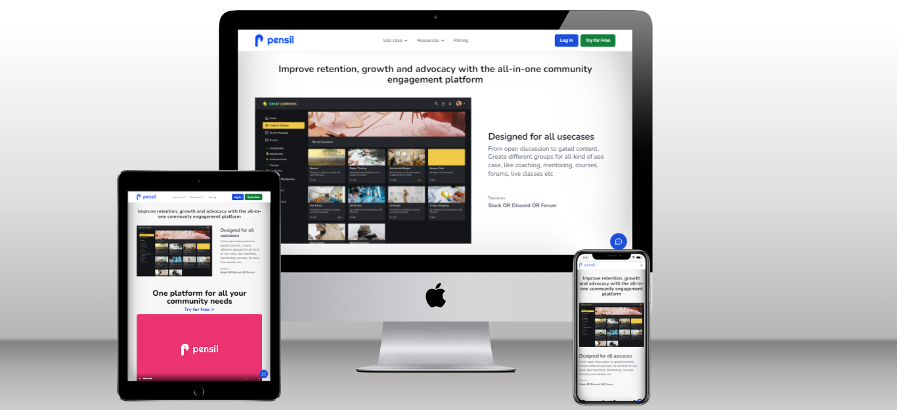

# Pensil Community Landing Page

## Who am I?
Hi, I'm `Vikas Rohra`, a web developer living in Mumbai, India.

  

## About Pensil
 - Pensil provides a flexible and robust community Platform where members can come together and interact with each other, participate in live discussions or take online learning courses. It is a multi-purpose platform that is currently being used in universities, cohort-based courses, public discussion forums, etc.
 
  

## Learnings
 - Usage of Tailwind CSS to build beautiful looking websites
 - Create responsive websites using Tailwind CSS 
 - Usage of Tailwind CSS animations and it's component libraries like [Flowbite](https://flowbite.com/) and [Tailblocks](https://tailblocks.cc/)

  

## Preview

## Live link
 [Pensil Community Landing Page](https://pensil-community-landing-page.netlify.app/)
 
 [Portfolio](https:vikasrohra.com)
